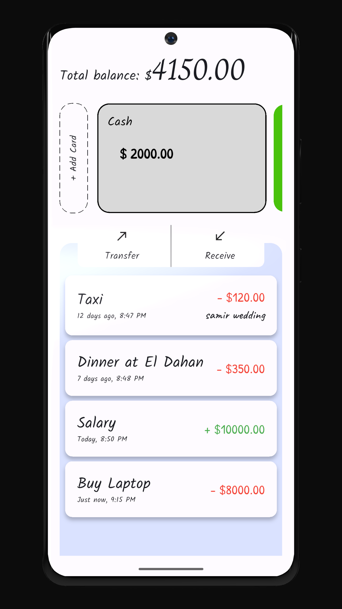
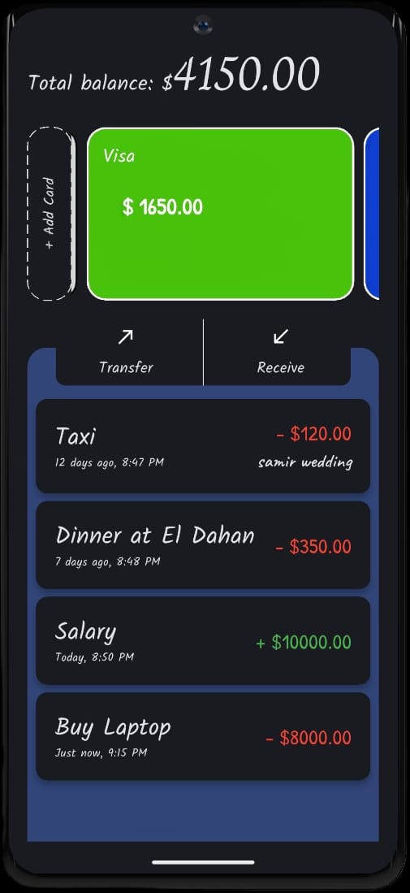
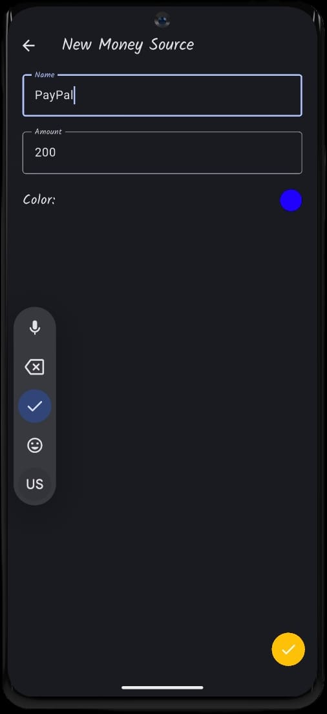
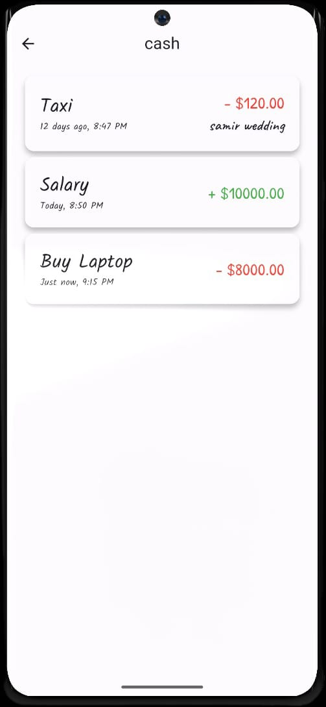
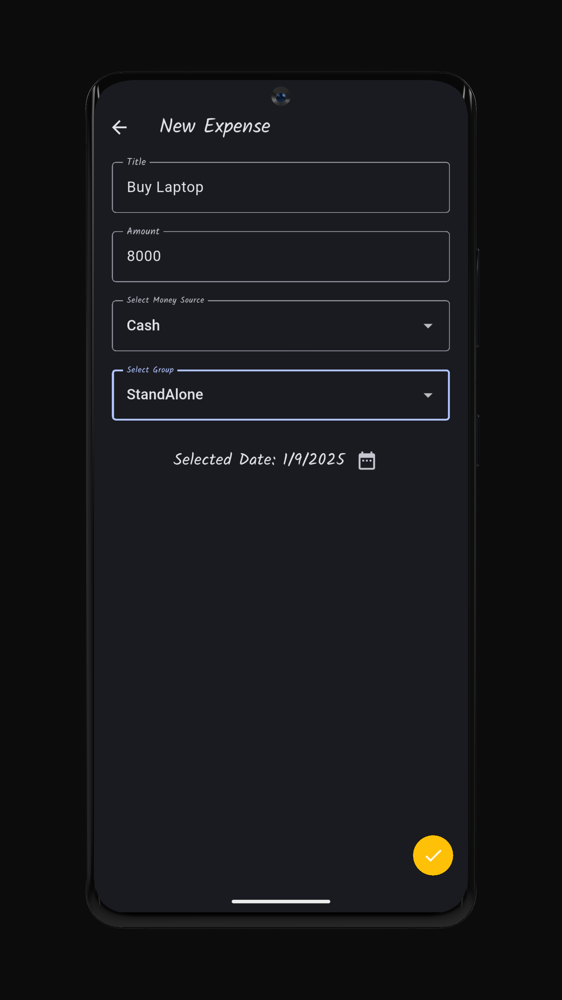
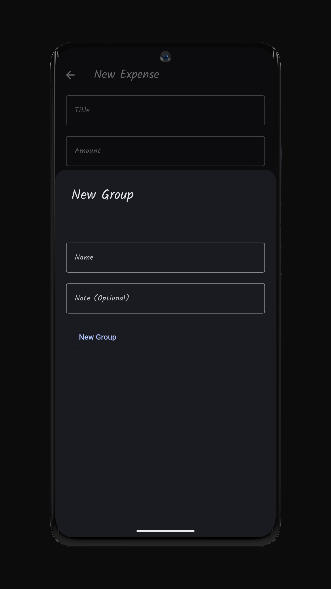
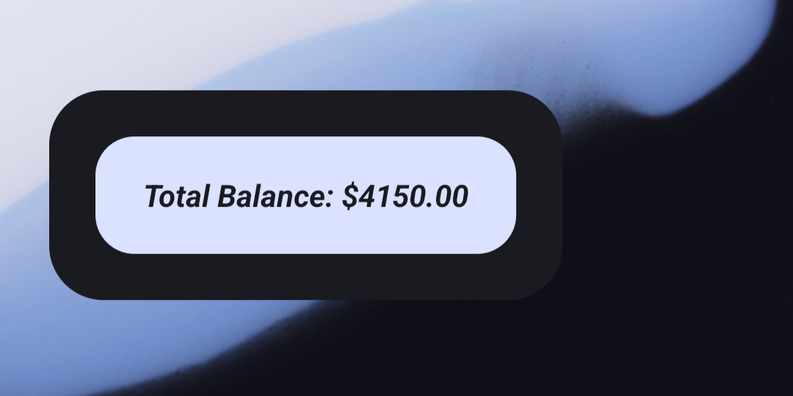

# Maleem

**Maleem** is a Flutter-based **personal expense tracker** that helps you manage income, expenses, and track your spending using grouped categories and multiple money sources.

This is **Version 1.2.0** of the app — a stable release with new features, responsive design, and internal code improvements.

## Features

- **Clear dashboard** showing your total balance, income, expenses, and money sources at a glance
- Manage **multiple accounts** such as cash, bank cards, or wallets, each with its own color for easy tracking
- Organize spending with **custom groups** (e.g., trips, bills, shopping) to see where your money goes
- **Quick search and filters** to find any transaction, group, or account instantly
- **Smooth experience on all devices** — the app adapts to different screen sizes (phones & tablets)
- **Modern design with dynamic colors** that match your phone’s theme for a personalized look
- **Easily add, edit, or delete** expenses, income, groups, and accounts anytime
- **Swipe away to delete** items with a single gesture for faster management
- **Fast & secure local storage** — your data is stored safely on your device, even offline
- **Smart forms with validation** so you never enter wrong or incomplete information by mistake
- **Quick balance check from Home Widget** — text automatically adapts to the widget size for perfect readability
- **Fun loading screen** with a smooth animated logo when launching the app
- **Professional branding with app logo** for a clean and polished feel

---

## Project Structure

```bash
lib/
├── core/
│   ├── app_text_styles.dart
│   └── hive_service.dart
│   └── ui_helper.dart
├── models/
│   ├── expense.dart
│   ├── expense.g.dart
│   ├── money_source.dart
│   ├── money_source.g.dart
│   ├── expense_group.dart
│   └── expense_group.g.dart
├── screens/
│   ├── home_screen.dart
│   ├── save_expense_screen.dart
│   ├── save_money_source_screen.dart
│   ├── save_group_screen.dart
│   └── filter_screen.dart
├── widgets/
│   ├── expense_item.dart
│   ├── money_source_card.dart
│   ├── expenses_viewer.dart
│   ├── custom_text_field.dart
│   ├── date_picker.dart
│   ├── form_scaffold.dart
│   └── done_fab.dart
└── main.dart
```

---

## Screenshots

<pre>
                                   
<table align="center">
  <tr>
    <td align="center">
      <br>
      
    </td>
  </tr>
</table>
</pre>

---

## Changelog

### v1.2.0 (Current)

- Added Home Widget integration

- Added loading state with custom animation logo

- Added app logo

- Improved internal architecture and stability

### v1.1.0

- Introduced Dynamic Color Support (Material You)

- Enhanced responsive design with flutter_screenutil

- Refactored core utilities into UIHelper for cleaner architecture

- UI/UX polish and adaptive layouts

### v1.0.0

- Initial release with core features:

- Dashboard overview (balance, sources, transactions)

- Multiple money sources with colors

- Expense groups (trips, bills, shopping, etc.)

- Add, update, delete for expenses, sources, groups

- Local storage with Hive

- Swipe-to-delete support
