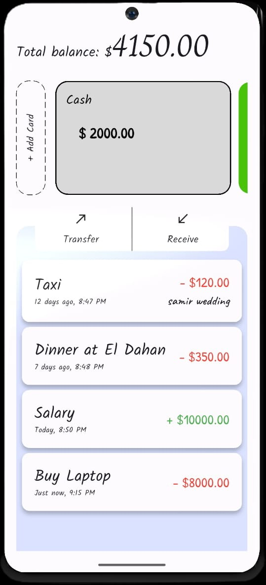
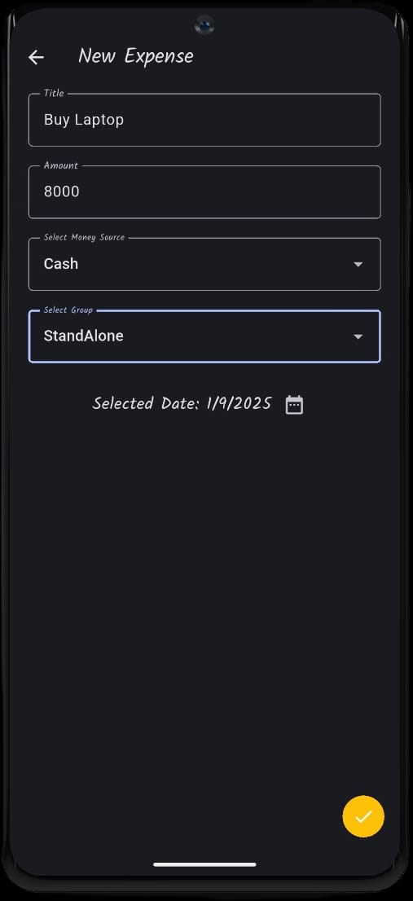
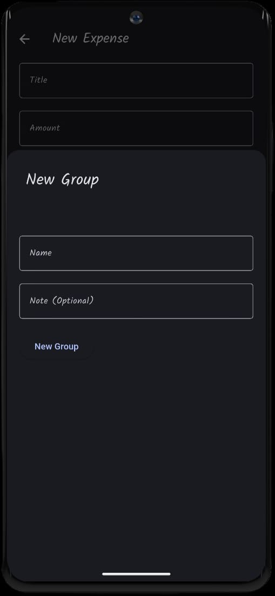

# Maleem

**Maleem** is a Flutter-based **personal expense tracker** that helps you manage income, expenses, and track your spending using grouped categories and multiple money sources.

This is **Version 1.1.0 (v1.1.0)** of the app — a stable release with responsive design and internal code improvements.

## Features

- **Dashboard overview** of total balance, money sources, and transactions
- Manage **multiple money sources** with custom colors (cash, bank accounts, wallets)
- Create and assign **expense groups** (e.g., trips, bills, shopping)
- **Filter and search** by group or money source
- **Responsive UI design** with `flutter_screenutil` → adapts layouts across different screen sizes (mobile & tablets)
- **Dynamic Color Support** → adapts to system Material You colors when available, and falls back to custom theme colors when not
- **Add, update, and delete** entries (expenses, income, groups, sources) with adaptive UI refresh
- **Swipe to delete** expenses and sources
- Data stored locally using **Hive** for fast and secure persistence
- Integrated input validation across forms
- **Refactored utilities** (e.g., date picker & save logic moved to `UIHelper`) for cleaner and maintainable code

---

## Project Structure

```bash
lib/
├── core/
│   ├── app_text_styles.dart
│   └── hive_service.dart
│   └── ui_helper.dart
├── models/
│   ├── expense.dart
│   ├── expense.g.dart
│   ├── money_source.dart
│   ├── money_source.g.dart
│   ├── expense_group.dart
│   └── expense_group.g.dart
├── screens/
│   ├── home_screen.dart
│   ├── save_expense_screen.dart
│   ├── save_money_source_screen.dart
│   ├── save_group_screen.dart
│   └── filter_screen.dart
├── widgets/
│   ├── expense_item.dart
│   ├── money_source_card.dart
│   ├── expenses_viewer.dart
│   ├── custom_text_field.dart
│   ├── date_picker.dart
│   ├── form_scaffold.dart
│   └── done_fab.dart
└── main.dart
```

---

## Screenshots

<pre>
                              
</pre>

---
